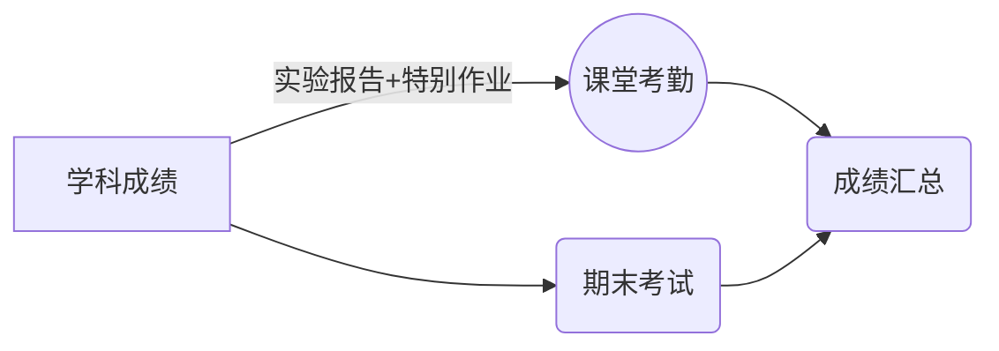

# 24-计算机网络技术3班成绩历史记录
本学期没有采用app实时展示成绩记录，现在直接在github上展示。每个同学可以看到自己成绩变化的情况。

- 公开，公开是最好的*主
- 公正
- 信息及时传递

## 课代表+10分，已经提前说明。

最近实验课发现有部分学生，在指定了打扫卫生的情况下，逃避打扫卫生。这种行为容易受到鄙视，大家共同的环境，需要一齐来维护。再出现类似问题，通报批评。（2025-10-14）

